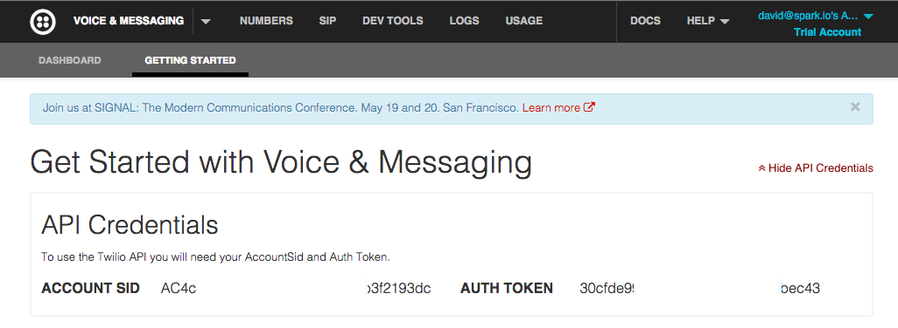

1.) Install the Spark-CLI and login!

	(more details here - https://github.com/spark/spark-cli)

	npm install -g spark-cli 
	spark login

2.) Create a Twilio account / grab your login info!

https://www.twilio.com/login

3.) Customize your twilio.json webhook with your phone numbers, and Twilio account info from above, and create your hook!

	spark webhook create twilio.json

4.) Compile your firmware and flash it to your core!

	spark compile . --saveTo twilio.bin
	spark flash coreName twilio.bin

5.) You'll get a text message when your core starts up!  Send more by calling the function on your device!

	spark call coreName twilio "Hello Texting World"

